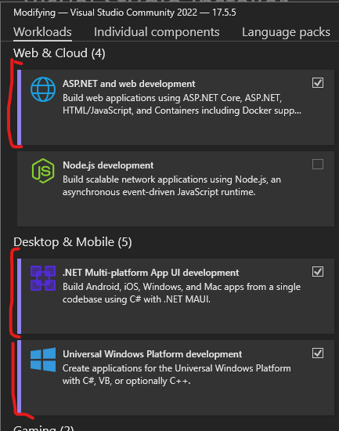

# Creating Your First Console App

## Project Overview

In this project we will be creating a simple console application that will loop through all files from a specified path and will return:

* List of all Files extensions
* Total file size based on extension
* Total number of lines of text per extension (if the file is a text file)
* Total number of characters in text files per extension

This will write to a file as JSON using `Newtonsoft.JSON` library and output to console using `Serilog` logging library.

## Project Creation

* Open Visual Studio and Click "Create a new project"\
  

1. Then select "C#" from the "Languages" drop down list\

2. Select "Console App" from the project template list\
   \
   Make sure it is **NOT** the (.Net Framework) or (.NET Core) version.
3. Then lets name the project as "Application" and the Solution as "My First Console App"\
   For more information about Solutions and Projects see: [solution-vs-project.md](../understanding-c/solution-vs-project.md "mention")\
   .png>)
4. Now select the framework, for this project we will use .NET 6.0 (LTS), however this should still work in later versions.\
   
5. Next check the box that says "Do not use top-level statements", this will add the class boilerplate code to your project when you click create.\
   .png>)
6. Now click create!

Now you should get some code that looks something like this:


```csharp
namespace Application
{
    internal class Program
    {
        static void Main(string[] args)
        {
            Console.WriteLine("Hello, World!");
        }
    }
}
```


